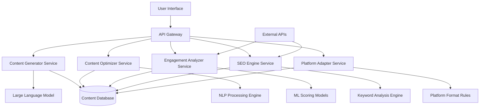

# Design Document: AI-Powered Content Creation and Optimization Assistant

## Overview

The AI-powered content creation and optimization assistant is a comprehensive system that leverages modern natural language processing and machine learning techniques to generate, optimize, and analyze content across multiple platforms. The system employs a modular architecture with specialized components for content generation, optimization, engagement analysis, and platform-specific adaptations.

Based on current industry research, the system will utilize sophisticated algorithms trained on diverse datasets to understand content patterns, styles, and engagement factors. The architecture follows established generative AI patterns with data collection, model selection, fine-tuning capabilities, and systematic review processes to ensure authentic, accurate content output.

## Architecture

The system follows a microservices architecture pattern with the following high-level components:



### Core Services

1. **API Gateway**: Central entry point handling authentication, rate limiting, and request routing
2. **Content Generator Service**: Handles new content creation using LLM integration
3. **Content Optimizer Service**: Manages content rewriting, summarization, and tone transformation
4. **Engagement Analyzer Service**: Provides content scoring and improvement recommendations
5. **SEO Engine Service**: Generates titles, keywords, and hashtags with SEO optimization
6. **Platform Adapter Service**: Ensures content meets platform-specific requirements

### External Integrations

- **Large Language Model API**: Primary content generation (OpenAI GPT, Anthropic Claude, or similar)
- **NLP Analysis APIs**: Google Cloud NLP, Azure Cognitive Services for advanced text analysis
- **SEO Data APIs**: Integration with keyword research and trend analysis services
- **Social Media APIs**: Platform-specific optimization rules and character limits

## Components and Interfaces

### Content Generator Service

**Primary Responsibilities:**
- Generate original content based on user parameters
- Ensure plagiarism-free output through content validation
- Integrate SEO keywords naturally into generated content
- Maintain content quality and coherence

**Key Interfaces:**
```typescript
interface ContentGenerationRequest {
  topic: string;
  contentType: ContentType;
  audience: AudienceType;
  tone: ToneType;
  length: LengthType;
  platform?: Platform;
  seoKeywords?: string[];
  additionalInstructions?: string;
}

interface ContentGenerationResponse {
  content: string;
  metadata: ContentMetadata;
  processingTime: number;
  qualityScore: number;
}
```

### Content Optimizer Service

**Primary Responsibilities:**
- Summarize long-form content while preserving key points
- Transform content tone and style for different audiences
- Rewrite content while maintaining factual accuracy
- Preserve embedded links, references, and citations

**Key Interfaces:**
```typescript
interface ContentOptimizationRequest {
  originalContent: string;
  operation: OptimizationType; // summarize, rewrite, transform_tone
  targetTone?: ToneType;
  targetAudience?: AudienceType;
  targetLength?: LengthType;
  preserveElements?: string[]; // links, citations, etc.
}

interface ContentOptimizationResponse {
  optimizedContent: string;
  changes: ContentChange[];
  preservedElements: PreservedElement[];
  qualityMetrics: QualityMetrics;
}
```

### Engagement Analyzer Service

**Primary Responsibilities:**
- Analyze content engagement potential using ML models
- Generate engagement scores (0-100) based on multiple factors
- Provide specific, actionable improvement suggestions
- Consider platform-specific engagement patterns

**Scoring Algorithm:**
Based on research findings, the engagement scoring considers:
- **Readability Score (25%)**: Flesch-Kincaid readability, sentence complexity
- **Emotional Appeal (20%)**: Sentiment analysis, emotional triggers
- **Call-to-Action Presence (15%)**: Identification of engagement prompts
- **Platform Optimization (20%)**: Format compliance, optimal length
- **Content Structure (10%)**: Headings, lists, visual elements
- **Keyword Relevance (10%)**: SEO keyword integration and density

**Key Interfaces:**
```typescript
interface EngagementAnalysisRequest {
  content: string;
  platform: Platform;
  targetAudience: AudienceType;
  contentType: ContentType;
}

interface EngagementAnalysisResponse {
  overallScore: number; // 0-100
  factorScores: {
    readability: number;
    emotionalAppeal: number;
    callToAction: number;
    platformOptimization: number;
    contentStructure: number;
    keywordRelevance: number;
  };
  improvements: ImprovementSuggestion[];
  processingTime: number;
}
```

### SEO Engine Service

**Primary Responsibilities:**
- Generate 3-5 SEO-optimized title options
- Provide platform-appropriate hashtag suggestions
- Identify relevant keywords based on content analysis
- Ensure optimal character limits for target platforms

**Key Interfaces:**
```typescript
interface SEOOptimizationRequest {
  content: string;
  platform: Platform;
  targetKeywords?: string[];
  contentType: ContentType;
}

interface SEOOptimizationResponse {
  titles: string[]; // 3-5 options
  hashtags: PlatformHashtags;
  keywords: string[];
  metaDescription?: string;
  seoScore: number;
}

interface PlatformHashtags {
  instagram?: string[]; // 15-30 hashtags
  twitter?: string[]; // 3-5 hashtags
  linkedin?: string[]; // 3-10 hashtags
}
```

### Platform Adapter Service

**Primary Responsibilities:**
- Apply platform-specific formatting and optimization rules
- Ensure content meets character limits and format requirements
- Add platform-appropriate elements (visual descriptions, professional tone)
- Validate content compliance with platform guidelines

**Platform-Specific Rules:**
- **Instagram**: Visual descriptions, 15-30 hashtags, story-friendly format
- **Twitter**: 280 character limit, 3-5 hashtags, engaging hooks
- **LinkedIn**: Professional tone, industry keywords, 3-10 hashtags
- **Blog**: SEO structure, headings, meta information
- **Website**: Web-friendly formatting, accessibility compliance

## Data Models

### Core Content Model
```typescript
interface ContentItem {
  id: string;
  content: string;
  contentType: ContentType;
  platform: Platform;
  audience: AudienceType;
  tone: ToneType;
  length: LengthType;
  metadata: ContentMetadata;
  engagementScore?: number;
  seoData?: SEOData;
  createdAt: Date;
  updatedAt: Date;
}

interface ContentMetadata {
  wordCount: number;
  characterCount: number;
  readabilityScore: number;
  keywordDensity: Record<string, number>;
  topics: string[];
  language: string;
}

interface SEOData {
  titles: string[];
  keywords: string[];
  hashtags: PlatformHashtags;
  metaDescription?: string;
  seoScore: number;
}
```

### Enumeration Types
```typescript
enum ContentType {
  BLOG_POST = 'blog_post',
  WEBSITE_ARTICLE = 'website_article',
  INSTAGRAM_POST = 'instagram_post',
  TWITTER_POST = 'twitter_post',
  LINKEDIN_POST = 'linkedin_post'
}

enum AudienceType {
  GENERAL_PUBLIC = 'general_public',
  STUDENTS = 'students',
  PROFESSIONALS = 'professionals',
  MARKETERS = 'marketers',
  BUSINESS_OWNERS = 'business_owners'
}

enum ToneType {
  PROFESSIONAL = 'professional',
  CASUAL = 'casual',
  MARKETING = 'marketing',
  FRIENDLY = 'friendly',
  PERSUASIVE = 'persuasive'
}

enum LengthType {
  SHORT = 'short',
  MEDIUM = 'medium',
  LONG = 'long'
}

enum Platform {
  INSTAGRAM = 'instagram',
  TWITTER = 'twitter',
  LINKEDIN = 'linkedin',
  BLOG = 'blog',
  WEBSITE = 'website'
}
```

### Analytics and Improvement Models
```typescript
interface ImprovementSuggestion {
  category: string;
  priority: 'high' | 'medium' | 'low';
  suggestion: string;
  expectedImpact: number; // 0-100
  implementation: string;
}

interface QualityMetrics {
  grammarScore: number;
  coherenceScore: number;
  originalityScore: number;
  relevanceScore: number;
  overallQuality: number;
}
```